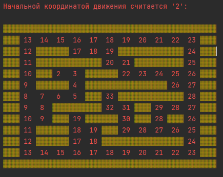

<h1 align="center"><b> Work 01 включает в себя: </b></h1>

---

<h2 align="center"><b> Unit01: </b></h2>

Урок 1. Знакомство с языком программирования Java
1. Задать одномерный массив и найти в нем минимальный и максимальный элементы.

2. Написать метод, который определяет, является ли введенный пользователем год високосным,
   и возвращает в консоль boolean (високосный - true, не високосный - false).
   Каждый 4-й год является високосным, кроме каждого 100-го, при этом каждый 400-й – високосный.

3. Дан массив nums = [3,2,2,3] и число val = 3.
   Если в массиве есть числа, равные заданному, нужно перенести эти элементы в конец массива.
   Таким образом, первые несколько (или все) элементов массива должны быть отличны от заданного, а остальные - равны ему.

##Структура и главный исполнительный файл(MainUnit01 - запускаем его):##

> MainUnit01.java
>                |__
>                   |Unit01
>                          |__
>                             | Task1.java
>                             | Task2.java
>                             | Task3.java

---

<h2 align="center"><b> Unit02: </b></h2>

Урок 2. Почему вы не можете не использовать API
1. Напишите метод, который принимает на вход строку (String) и определяет 
   является ли строка палиндромом (возвращает boolean значение).
2. Напишите метод, который составит строку, состоящую из 100 повторений слова TEST и метод,
   который запишет эту строку в простой текстовый файл, обработайте исключения.

##Структура и главный исполнительный файл(MainUnit02 - запускаем его):##

> MainUnit02.java
>                |__
>                   |Unit02
>                          |__
>                             | Task1.java
>                             | Task2.java

---

<h2 align="center"><b> Unit03: </b></h2>

Урок 3. Коллекции JAVA: Введение
1. Пусть дан произвольный список целых чисел, удалить из него четные числа
   (в языке уже есть что-то готовое для этого)
2. Задан целочисленный список ArrayList. Найти минимальное, максимальное и
   среднее арифметическое из этого списка.

##Структура и главный исполнительный файл(MainUnit03 - запускаем его):##

> MainUnit03.java
>                |__
>                   |Unit03
>                          |__
>                             | Task1.java
>                             | Task2.java

---

<h2 align="center"><b> Unit04: </b></h2>

Урок 4. Хранение и обработка данных ч1: приоритетные коллекции
1. Реализовать консольное приложение, которое:
   Принимает от пользователя и “запоминает” строки.
   Если введено print, выводит строки так, чтобы последняя введенная была первой в списке, а первая - последней.
   Если введено revert, удаляет предыдущую введенную строку из памяти.

2. Пусть дан LinkedList с несколькими элементами. Реализуйте метод, который вернет “перевернутый” список.

##Структура и главный исполнительный файл(MainUnit04 - запускаем его):##

> MainUnit04.java
>                |__
>                |  |Unit04
>                |         |__
>                |            | Task1.java
>                |            | Task2.java
>                |__
>                   |Data
>                        |__
>                           | test.txt [test.txt](Data%2Ftest.txt)
 

---

<h2 align="center"><b> Unit05: </b></h2>

Урок 5. Хранение и обработка данных ч2: множество коллекций Map
1. Реализовать алгоритм волновой
2. Написать программу, которая из введенного массива данных из 0 и 1 преобразует в карту и вычисляет,
   какой путь наиболее короткий, при этом пользователь задав по коррдинатам начальную и конечную точку соответственно .

Получившийся результат:

##Структура и главный исполнительный файл(MainUnit05 - запускаем его):##

> MainUnit05.java
>                |__
>                   |Unit05
>                          |__
>                             | [WavePro.java](Unit05/WavePro.java)
>                             | [Position.java](Unit05/Position.java)

---

<h2 align="center"><b> Unit06: </b></h2>

Урок 6. Хранение и обработка данных ч3: множество коллекций Set
1. Подумать над структурой класса Ноутбук для магазина техники - выделить поля и методы. Реализовать в java.
2. Создать множество ноутбуков (ArrayList).
3. Отфильтровать ноутбуки их первоначального множества и вывести проходящие по условиям. 
   Например, спросить у пользователя минимальный размер оперативной памяти или конкретный цвет. 
   Выводить только те ноутбуки, что соответствуют условию.

##Структура и главный исполнительный файл(MainUnit06 - запускаем его):##

> MainUnit06.java
>                |__
>                   |Unit06
>                          |__
>                             | [Main.java](Unit06/Main.java)
>                             | [NoteBook.java](Unit06/NoteBook.java)
>                             | [notebooks_database.csv](Unit06/notebooks_database.csv)

---

Спасибо за внимание!