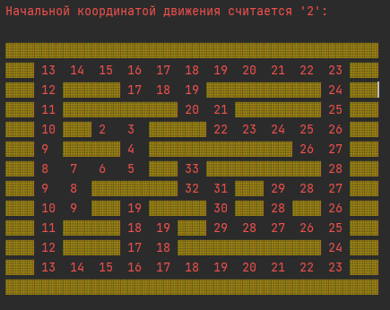

<h2 align="center"><b> Задача: </b></h2>
Написать программу, которая из введенного массива данных из 0 и 1 преобразует в карту и вычисляет,
какой путь наиболее короткий, при этом пользователь задав по коррдинатам начальную и конечную точку соответственно .

Получившийся результат:

